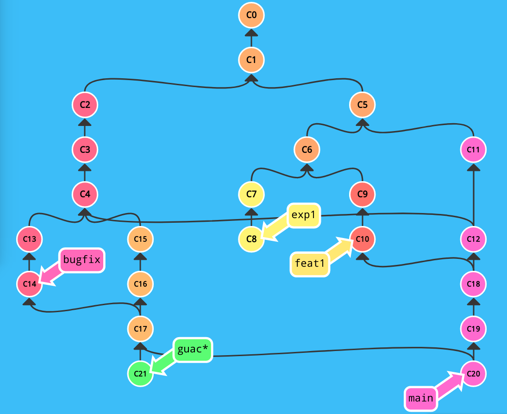

# Lab 5: Version Control
Credit: Henry Schreiner, Romain Teyssie (https://henryiii.github.io/se-for-sci/)

## Overview

Our course material is in Git. All the open-source software we use is in Git.
Linux is in Git. It's the basis of modern software development. We'll work on
Git in detail later, but here are a few quick basics:

## Repositories

The core "unit" of Git is a **repository**. Repositories hold your code, along
with all history. The online version of the repository is called a **remote**.
Getting a copy of the repository locally is called **cloning**.

## History

The history of a Git repository is stored with it. Each stored point in time is
called a **commit**. Git is a bit clever in how it stores history, so making
lots of commits is fairly cheap. Multiple commits can share a parent, making the
commit history look a bit like a tree (technically a graph, since you can also
share parents, but we won't worry about that too much yet).

You can create a moving "name" that points at a commit called a **branch**, or a
stationary name called a **tag** (at least it should be stationary). One of the
reasons for this is that all git commits are "named" by their SHA hash. Why not
a nice, incrementing number? Because git is distributed.

## Distributed

Unlike older systems, every full git checkout is a complete, independent copy of
the repository! You have all history locally. If you clone a remote repository,
you could push to a different remote if you wished. If GitHub, GitLab, or
whatever other **hosting** service you are using disappears tomorrow, you can
simply push somewhere else and have all your history intact.

## Hosted

Services like GitHub, GitLab, and BitBucket host git remotes. They usually add
web UI features that are not part of git, as well, like "pull requests/merge
requests", "issues", and "forks". This is stored as part of the hosting system
and is not part of your git repository.

## Version control quick intro

In a terminal, you can clone a public repository. Let's try cloning the
packaging repo, a small Python library:

```bash
git clone https://github.com/pypa/packaging
```

Now enter the directory just created:

```bash
cd packaging
```

Verify nothing has changed and verify you are on the `main` branch:

```bash
git status
```

Make sure you are up to date (you should be if you just cloned it!)

```bash
git pull
```

Check the tags:

```bash
git tag
```

Switch to a recent release:

```bash
git checkout 21.3
```

Note that git is complaining because you are on a tag now, instead of a branch.
That's okay, we won't be doing any development, we are just practicing. When you
checkout a specific commit or tag, any tracked file in the repo is updated to
match how the repository looked at that point in history, similar to a backup of
your filesystem.

Go back to main:

```bash
git checkout main
```

Actually, what has changed since 21.3?

```bash
git log 21.3..main
git diff 21.3
```

We'll go into git more later, but you should at least be comfortable consuming
git repositories. Later we'll work on contributing and collaborating.

## Intro to git

Good practice in programming project management requires a version control
system.

Old school techniques are usually bad.

- Version filenames is a disaster.

  - `mythesis_v1.tex`, `mythesis_v2.tex`, `mythesis_last_v3.tex`
  - creates clutter
  - Filenames rarely contain information other than chronology
  - Parallel independent changes super hard to keep track of
  - Did you finally notice a problem in v119 that has been around for a while,
    but you have no idea where the error was introduced?

- Sharing files with others is a disaster.

  - Emailing files sucks --- only magnifies the problems above
  - Track changes feature Google Docs or Word --- not so useful for anything
    complex

- Disaster recover is a disaster.
  - Oh F#@K! Did I just overwrite all my work from last night??!!!?


Modern version control techniques are usually great.

Modern tools to promote collective intelligence.

- Automated history of everything

  - not just files, but whole projects with folders and subfolders
  - who, what, when, and (most important) why

- Automated sharing of everyone's latest edits

  - no more emailing files around

- Easier disaster recovery with distributed VCSes like Git or Mercurial (see
  later)

- Support for automated testing (we'll cover this in future lectures)

- Infinite sandboxes for clutter-free, fear-free experimentation

  - this is where Git especially shines -- main topic today

- CAVEAT 1: All of this works best with plain text files

- CAVEAT 2: All of this works best with a highly modular file structure

- The git feedback effect:
  - Using git encourages positive changes to your workflow.
  - And making your workflow more git-friendly will make your work better
    overall.

## Brief history of version control.


- Local Version Control

  - Mainly just reduced clutter and automated tracking of chronology...

- Centralized Version Control

  - Allows group work on the same files...
  - Single point of failure --- there is only a single "real" repository
  - Backing up is a separate process
  - File locks --- create "race conditions" for committing changes to that
    "real" repository
  - What if you lose internet?
  - Branching is cumbersome, so people don't do it (and have trouble reconciling
    disparate histories when they do)

- Distributed Version Control
  - Resolve most of the above issues...
  - Many separate and independent repos; all are "first-class" citizens
  - Can make commits locally even without internet...
  - ...but can transfer history and information between repositories
  - Branching is lightweight and easy (mainly in Git)

## Core concepts in git

Branches and DAGs

A DAG is a directed acyclic graph linking together a sequence of tasks.

Let's calibrate people's intuitions about git terminology: how many branches are
in this DAG?



Best way to get comfortable conceptually with git branching is to see it in
action.

So let's do an exercise...

Things to keep in mind during our exercise

- Just a quick tour

- There is a 2-part PICSciE workshop on Git on Oct 05 and 07. Do it!

- Some git operations are of a "send it out" variety, while others are of a
  "bring it in" variety

  - important to keep straight which are of which flavor

- Some git operations are repo-wise, while others are branch-wise

Your git branching sandbox

Open a browser to this URL: https://learngitbranching.js.org/?NODEMO

Other resources for git:

- https://gitimmersion.com/
- http://think-like-a-git.net/
- http://ndpsoftware.com/git-cheatsheet.html
- https://ohshitgit.com/
- http://gitready.com/
- https://explainshell.com/

## Getting started with git

Setting up your git environment. On your Terminal window, type the following
commands.

```console
$ git config --global user.name '<firstname> <lastname>'
$ git config --global user.email '<email>'
```

Create a new directory.

```console
$ mkdir mywork
$ cd mywork
```

Create a new git project.

```console
$ git init
Initialized empty Git repository in /Users/rt3504/mywork/.git/
```

Now edit your first file.

```console
$ echo "This is my first file" > file1.txt
```

Add this file to the staging area and commit your first change.

```console
$ git add file1.txt
$ git commit -m "First commit"
[master (root-commit) c073d19] First commit
 1 file changed, 1 insertion(+)
 create mode 100644 file1.txt
```

What is the staging area? This is where you put your modifications in the queue,
one after the other, using the `git add` command. git tracks only differences
between successive versions. You can then commit these changes to the repository
with the `git commit` command.

## Checking the status of your repository

We can now check the status of our repository using the command

```console
$ git status
On branch master
nothing to commit, working tree clean
```

Let's now make our first change.

```console
$ echo "This is my first file but I modified it." > file1.txt
```

Let see now the status of our repository.

```console
$ git status
On branch master
Changes not staged for commit:
  (use "git add <file>..." to update what will be committed)
  (use "git restore <file>..." to discard changes in working directory)
	modified:   file1.txt

no changes added to commit (use "git add" and/or "git commit -a")
```

Let's add these changes to the staging area.

```console
$ git add file1.txt
$ git status
On branch master
Changes to be committed:
  (use "git restore --staged <file>..." to unstage)
	modified:   file1.txt
```

Let's commit those changes.

```console
$ git commit -m "Commit changes"
[master 476b980] Commit changes
 1 file changed, 1 insertion(+), 1 deletion(-)
$ git status
On branch master
nothing to commit, working tree clean
```

When you commit changes, using `git commit -m` allows you to give a commit
message on the command line. Without the `-m` options, git will launch an editor
(default is usually `vim`). To set your own editor, use:

```console
$ export GIT_EDITOR='emacs -nw'
```

Try and see what happens if you commit another change without the `-m` option.
Just follow the instruction, add your message in your favorite text editor and
save the file.

## View the history of your project

To see the past history of your project, type:

```console
$ git log
commit 476b9801a6fb1efefdcd6c4d1bc82bff43686f9e (HEAD -> master)
Author: Romain Teyssier <romain.teyssier@gmail.com>
Date:   Thu Oct 6 09:48:30 2022 -0400

    Commit changes

commit c073d19d60ca399ab70e9a9b720cefeaa36c84a6
Author: Romain Teyssier <romain.teyssier@gmail.com>
Date:   Thu Oct 6 09:37:43 2022 -0400

    First commit
```

A nicer way of looking at the history of your repository:

```console
$ git log --pretty=format:'%h %ad | %s%d [%an]' --graph --date=short
* 476b980 2022-10-06 | Commit changes (HEAD -> master) [Romain Teyssier]
* c073d19 2022-10-06 | First commit [Romain Teyssier]
```

Another more complex example with the RAMSES code (see all the way down this
page how to get it):

```console
$ git log --pretty=format:'%h %ad | %s%d [%an]' --graph --date=short
* c6935e35 2022-10-06 | Remove link to obsolete web site. (HEAD -> master, origin/master, origin/HEAD) [Romain Teyssier]
* 7ff87436 2022-10-05 | Fix an issue with geticmask [Romain Teyssier]
* 25683b3e 2022-10-05 | Fix some remaining issues with get_music_refmask.f90 [Romain Teyssier]
*   f18b114f 2022-10-05 | Merge branch 'master' of https://bitbucket.org/rteyssie/ramses [Romain Teyssier]
|\
| * e1a84c3d 2022-10-05 | Fix reading in get_music_refmask for zoom IC generation [Romain Teyssier]
| * 693af13e 2022-10-05 | Fix reading in get_music_refmask for zoom IC generation [Romain Teyssier]
| *   050cb1f0 2022-06-28 | Merged in master (pull request #498) [Benoit Commercon]
| |\
| | * 01939fbc 2022-06-28 | Update patch/mhd/coeur to work with the latest version [Benoit Commercon]
| |/
| *   168872a9 2022-06-21 | Merge branch 'master' of bitbucket.org:rteyssie/ramses [rteyssier]
| |\
| | *   dc87ff86 2022-06-17 | Merge branch 'master' of bitbucket.org:rteyssie/ramses [Romain Teyssier]
| | |\
| | * \   1fb6d9aa 2022-06-09 | Merge branch 'master' of bitbucket.org:rteyssie/ramses [Romain Teyssier]
| | |\ \
| | * \ \   ecfbf508 2022-06-09 | Merge branch 'master' of bitbucket.org:rteyssie/ramses [Romain Teyssier]
| | |\ \ \
| | * \ \ \   52f82b4c 2022-05-13 | Merge branch 'master' of bitbucket.org:rteyssie/ramses [Romain Teyssier]
| | |\ \ \ \
| | * \ \ \ \   79c3a2ff 2022-05-12 | Merge branch 'master' of bitbucket.org:rteyssie/ramses [Romain Teyssier]
| | |\ \ \ \ \
| | * \ \ \ \ \   9cb29fad 2022-05-10 | Merge branch 'master' of bitbucket.org:rteyssie/ramses [Romain Teyssier]
| | |\ \ \ \ \ \
| | * \ \ \ \ \ \   0afc647d 2022-03-12 | Merge branch 'master' of bitbucket.org:rteyssie/ramses [Romain Teyssier]
| | |\ \ \ \ \ \ \
| | * \ \ \ \ \ \ \   0c064bc7 2022-03-11 | Merge branch 'master' of bitbucket.org:rteyssie/ramses [Romain Teyssier]
| | |\ \ \ \ \ \ \ \
| | * \ \ \ \ \ \ \ \   28a59d77 2022-01-24 | Merge branch 'master' of bitbucket.org:rteyssie/ramses [Romain Teyssier]
| | |\ \ \ \ \ \ \ \ \
| | * \ \ \ \ \ \ \ \ \   378c2575 2022-01-07 | Merge branch 'master' of bitbucket.org:rteyssie/ramses [Romain Teyssier]
| | |\ \ \ \ \ \ \ \ \ \
| | * | | | | | | | | | | c305dc3e 2022-01-07 | add single test execution script [Romain Teyssier]
| * | | | | | | | | | | | 40da76fa 2022-06-21 | Fix a big in map2img.py [rteyssier]
| | |_|_|_|_|_|_|_|_|_|/
| |/| | | | | | | | | |
| * | | | | | | | | | | 454bc45b 2022-06-17 | Add OUTPUT_PARTICLE_DENSITY pre-compiler directive for output_poisson in grav files [rteyssier]
* | | | | | | | | | | | aa383b47 2022-06-17 | Merge branch 'master' of https://bitbucket.org/rteyssie/ramses [Romain Teyssier]
|\| | | | | | | | | | |
| * | | | | | | | | | | ef88770b 2022-06-17 | Modify amr2map to read grav file instead of hydro file [rteyssier]
| | |_|_|_|_|_|_|_|_|/
| |/| | | | | | | | |
* / | | | | | | | | | 54052ade 2022-06-17 | Modify amr2map to read grav file instead of hydro file [Romain Teyssier]
|/ / / / / / / / / /
* | | | | | | | | / 9c3316ae 2022-06-09 | Correct a nasty bug in case of MC tracers. part2map.f90 edited online with Bitbucket [Romain Teyssier]
| |_|_|_|_|_|_|_|/
|/| | | | | | | |
```

## Manipulating history

Now, we will create two new files `file2.txt` and `file3.txt`, each time staging
and committing the new file. Your history must now look like this:

```console
$ git log --pretty=format:'%h %ad | %s%d [%an]' --graph --date=short
* 41f8d80 2022-10-06 | Committing file3 (HEAD -> master) [Romain Teyssier]
* c6e6535 2022-10-06 | Committing file2 [Romain Teyssier]
* 476b980 2022-10-06 | Commit changes [Romain Teyssier]
* c073d19 2022-10-06 | First commit [Romain Teyssier]
```

Inside our repository, we have the following files:

```console
$ ls
file1.txt file2.txt file3.txt
```

Let's now move back in time and put the pointer of our time coordinate back to
when we only had `file1.txt`.

For this, we use the command `git checkout <HASH>` where `<HASH>` is the hash key (7
digits) corresponding to the previous commit are targeting. In our example, we
will type

```console
$ git checkout 476b980
Note: switching to '476b980'.

You are in 'detached HEAD' state. You can look around, make experimental
changes and commit them, and you can discard any commits you make in this
state without impacting any branches by switching back to a branch.

If you want to create a new branch to retain commits you create, you may
do so (now or later) by using -c with the switch command. Example:

  git switch -c <new-branch-name>

Or undo this operation with:

  git switch -

Turn off this advice by setting config variable advice.detachedHead to false

HEAD is now at 476b980 Commit changes
```

Inside our repository, we are back to the previous state with only one file:

```console
$ ls
file1.txt
```

If we check our past history, we only see the old version of it.

```console
$ git log --pretty=format:'%h %ad | %s%d [%an]' --graph --date=short
* 476b980 2022-10-06 | Commit changes (HEAD) [Romain Teyssier]
* c073d19 2022-10-06 | First commit [Romain Teyssier]
```

We can go back to the last version using

```console
$ git checkout master
Previous HEAD position was 476b980 Commit changes
Switched to branch 'master'
$ ls
file1.txt file2.txt file3.txt
```

## Creating tags

Switching between commits can be made easier using the `git tag` command. Let's
tag the current state (the last version of our repository) using

```console
$ git tag v2
```

Now let's go back to the first version of our repository using

```console
$ git checkout 476b980
```

We now tag this first version using

```console
$ git tag v1
```

It is now really easy to go back to the second version using

```console
$ git checkout v2
```

without using the weird hash key.

We can look at the history of our repository and see:

```console
$ git log --pretty=format:'%h %ad | %s%d [%an]' --graph --date=short
* 41f8d80 2022-10-06 | Committing file3 (HEAD -> master, tag: v2) [Romain Teyssier]
* c6e6535 2022-10-06 | Committing file2 [Romain Teyssier]
* 476b980 2022-10-06 | Commit changes (tag: v1) [Romain Teyssier]
* c073d19 2022-10-06 | First commit [Romain Teyssier]
```

You see now the tags `v1` and `v2` in the list of commits. You can also see the
list of all the tags in your repository using the `git tag` command as

```console
$ git tag
v1
v2
```

## Creating branches

Let us say we are not happy with our current version of the code. We would like
to go back to `v1` and start fresh.

We use

```console
$ git checkout v1
$ git log --pretty=format:'%h %ad | %s%d [%an]' --graph --date=short
* 476b980 2022-10-06 | Commit changes (HEAD, tag: v1) [Romain Teyssier]
* c073d19 2022-10-06 | First commit [Romain Teyssier]
$ ls
file1.txt
```

Now let's create a new empty file with a new file name

```console
$ touch file4.txt
$ git add file4.txt
$ git commit -m "A better code now?"
$ ls
file1.txt file4.txt
$ git log --pretty=format:'%h %ad | %s%d [%an]' --graph --date=short
* 1e19277 2022-10-07 | A better code now? (HEAD) [Romain Teyssier]
* 476b980 2022-10-06 | Commit changes (tag: v1) [Romain Teyssier]
* c073d19 2022-10-06 | First commit [Romain Teyssier]
```

And another one

```console
$ touch file5.txt
$ git add file5.txt
$ git commit -m "Yes it is a better code"
$ ls
file1.txt file4.txt file5.txt
```

Let's go back again to our second version `v2`

```console
$ git checkout v2
Warning: you are leaving 2 commits behind, not connected to
any of your branches:

  6ed6b75 Yes it is a better code
  1e19277 A better code now?

If you want to keep them by creating a new branch, this may be a good time
to do so with:

 git branch <new-branch-name> 6ed6b75

HEAD is now at 41f8d80 Committing file3
```

You see that git is not happy because you didn't create a branch for all these
new commits. Indeed, you have created a new thread of commits that are in
competition with what you did before. You have now 2 diverging code versions.
Let's follow git's advice and create a new branch for these 2 new commits

```console
$ git branch better_code 6ed6b75
```

We can see how many branches we have using the `git branch` command

```console
$ git branch
* (HEAD detached at v2)
  better_code
  master
```

We can now see in the history of our repository all the branches using the
`--all` option as

```console
$ git log --pretty=format:'%h %ad | %s%d [%an]' --graph --date=short --all
* 6ed6b75 2022-10-07 | Yes it is a better code (better_code) [Romain Teyssier]
* 1e19277 2022-10-07 | A better code now? [Romain Teyssier]
| * 41f8d80 2022-10-06 | Committing file3 (HEAD, tag: v2, master) [Romain Teyssier]
| * c6e6535 2022-10-06 | Committing file2 [Romain Teyssier]
|/
* 476b980 2022-10-06 | Commit changes (tag: v1) [Romain Teyssier]
* c073d19 2022-10-06 | First commit [Romain Teyssier]
```

If you don't use `--all` you only see the history of the branch you sit on,
namely here the master branch

```console
$ git log --pretty=format:'%h %ad | %s%d [%an]' --graph --date=short
* 41f8d80 2022-10-06 | Committing file3 (HEAD, tag: v2, master) [Romain Teyssier]
* c6e6535 2022-10-06 | Committing file2 [Romain Teyssier]
* 476b980 2022-10-06 | Commit changes (tag: v1) [Romain Teyssier]
* c073d19 2022-10-06 | First commit [Romain Teyssier]
```

If you examine the content of your repository, you see only the files in the
`master` branch.

```console
$ ls
file1.txt file2.txt file3.txt
```

Let's go back to the other branch

```console
$ git checkout better_code
Previous HEAD position was 41f8d80 Committing file3
Switched to branch 'better_code'
```

We can check we are on the right branch using

```console
$ git branch
* better_code
  master
```

We only see the files of the second branch (our better version of the code).

```console
$ ls
file1.txt file4.txt file5.txt
```

Without the `--all` option, we also only see the history of this branch.

```console
$ git log --pretty=format:'%h %ad | %s%d [%an]' --graph --date=short
* 6ed6b75 2022-10-07 | Yes it is a better code (HEAD -> better_code) [Romain Teyssier]
* 1e19277 2022-10-07 | A better code now? [Romain Teyssier]
* 476b980 2022-10-06 | Commit changes (tag: v1) [Romain Teyssier]
* c073d19 2022-10-06 | First commit [Romain Teyssier]
```

## Merging branches

Now that we have a better code, we want to import in this better branch what was
done in the `master` branch. In other words, we want to merge to work done in
these 2 diverging versions of the code. We can do this using the `git merge`
command.

First, let's check we are in the correct branch using

```console
$ git branch
* better_code
  master
```

Second, let's merge the `master` branch into the `better_code` branch.

```console
$ git merge master -m "Merging previous work in better version of the code"
Merge made by the 'recursive' strategy.
 file2.txt | 0
 file3.txt | 0
 2 files changed, 0 insertions(+), 0 deletions(-)
 create mode 100644 file2.txt
 create mode 100644 file3.txt
```

We can now have a look at the history using the `--all` option.

```console
$ git log --pretty=format:'%h %ad | %s%d [%an]' --graph --date=short --all
*   8b3b89f 2022-10-07 | Merge branch 'master' into better_code Merging previous work in better version of the code (HEAD -> better_code) [Romain Teyssier]
|\
| * 41f8d80 2022-10-06 | Committing file3 (tag: v2, master) [Romain Teyssier]
| * c6e6535 2022-10-06 | Committing file2 [Romain Teyssier]
* | 6ed6b75 2022-10-07 | Yes it is a better code [Romain Teyssier]
* | 1e19277 2022-10-07 | A better code now? [Romain Teyssier]
|/
* 476b980 2022-10-06 | Commit changes (tag: v1) [Romain Teyssier]
* c073d19 2022-10-06 | First commit [Romain Teyssier]
```

You can see how the branches are now converging back together. Let's see what we
have in our repository now.

```console
$ ls
file1.txt file2.txt file3.txt file4.txt file5.txt
```

Wow! We have everything now.

Let's now try something more difficult. We go back to the master branch and
modify directly the text inside `file1.txt`.

```console
$ git branch master
```

Edit file1.txt in order to obtain

```console
$ cat file1.txt
This is my first file but I modified it again to match the better code version.
```

Let's commit these changes as usual.

```console
$ git add file1.txt
$ git commit -m "Modify file1.txt"
```

Let's go back to the `better_code` branch again and merge these changes from the
`master` branch.

```console
$ git merge master -m "Trying to merge again"
Merge made by the 'recursive' strategy.
 file1.txt | 2 +-
 1 file changed, 1 insertion(+), 1 deletion(-)
```

Wow! It worked flawlessly.

## Resolving conflicts

Let's try something more complex. Go in the `better_code` branch and edit
file1.txt so that it looks like

```console
$ cat file1.txt
I went crazy!
```

Obviously you decided to make drastic changes here. Commit these changes to the
repository (using `git add` and `git commit` in sequence). Now go back to the
`master` branch. Edit `file1.txt` to make more sensible changes.

```console
$ cat file1.txt
This is my first file but I modified it one more time to match the better code version.
```

Now go back again to the `better_code` branch and try and merge the `master`
branch.

```console
$ git merge master
Auto-merging file1.txt
CONFLICT (content): Merge conflict in file1.txt
Automatic merge failed; fix conflicts and then commit the result.
```

Crap! We have a conflict between the two different commits. `file1.txt` now
looks like this:

```console
$ cat file1.txt
<<<<<<< HEAD
I went crazy!

=======
This is my first file but I modified it one more time to match the better code version.
>>>>>>> master
```

You must now edit yourself this file and decide which version to use. Obviously,
you want to use the correct version that looks like

```console
$ cat file1.txt
This is my first file but I modified it one more time to match the better code version.
```

Now that the file has been properly edited, you can commit the fixed changes
using as usual

```console
$ git add file1.txt
$ git commit -m "Fixed conflict"
[better_code 1243e96] Fixed conflict
```

Pfew! That was stressful but it all went back to normal.

Now that you happy with your better version of the code, you can merge back
everything to the `master` branch.

```console
$ git checkout master
Switched to branch 'master'
$ git merge better_code -m "Final merge back to master"
Updating abc9ee2..1243e96
Fast-forward (no commit created; -m option ignored)
 file4.txt | 0
 file5.txt | 0
 2 files changed, 0 insertions(+), 0 deletions(-)
 create mode 100644 file4.txt
 create mode 100644 file5.txt
$ ls
file1.txt file2.txt file3.txt file4.txt file5.txt
```

Now the `master` and the `better_code` branches are identical. You can check the
history of the `master` branch.

```console
$ git log --pretty=format:'%h %ad | %s%d [%an]' --graph --date=short
*   1243e96 2022-10-07 | Fixed conflict (HEAD -> master, better_code) [Romain Teyssier]
|\
| * abc9ee2 2022-10-07 | One more modif to file1 [Romain Teyssier]
* | 1cba3e4 2022-10-07 | I went crazy [Romain Teyssier]
* | ce60f0f 2022-10-07 | Trying to merge again [Romain Teyssier]
|\|
| * 07557d4 2022-10-07 | Modify file1.txt [Romain Teyssier]
* | 8b3b89f 2022-10-07 | Merge branch 'master' into better_code This is necessary. [Romain Teyssier]
|\|
| * 41f8d80 2022-10-06 | Committing file3 (tag: v2) [Romain Teyssier]
| * c6e6535 2022-10-06 | Committing file2 [Romain Teyssier]
* | 6ed6b75 2022-10-07 | Yes it is a better code [Romain Teyssier]
* | 1e19277 2022-10-07 | A better code now? [Romain Teyssier]
|/
* 476b980 2022-10-06 | Commit changes (tag: v1) [Romain Teyssier]
* c073d19 2022-10-06 | First commit [Romain Teyssier]
```

## Cloning a repository

When working in a large team of developers, it might be useful to duplicate the
entire repository across different machines. git is ideally suited for this kind
of collaborative development. For simplicity, we will duplicate the current
repository on your own laptop, but pretend this is in fact a different developer
writing code on a different computer.

First go up one level in your file system to see your directory `mywork`.

```console
$ cd ..
$ ls
mywork
```

Now we will clone the repository using the `git clone` command.

```console
$ git clone mywork cloned_work
Cloning into 'cloned_work'...
done.
$ cd cloned_work
$ ls
file1.txt file2.txt file3.txt file4.txt file5.txt
```

You can see that all the files of the original repository are here. Looking at
the history of the cloned repository, now we get

```console
git log --pretty=format:'%h %ad | %s%d [%an]' --graph --date=short
*   1243e96 2022-10-07 | Fixed conflict (HEAD -> master, origin/master, origin/better_code, origin/HEAD) [Romain Teyssier]
|\
| * abc9ee2 2022-10-07 | One more modif to file1 [Romain Teyssier]
* | 1cba3e4 2022-10-07 | I went crazy [Romain Teyssier]
* | ce60f0f 2022-10-07 | Trying to merge again [Romain Teyssier]
|\|
| * 07557d4 2022-10-07 | Modify file1.txt [Romain Teyssier]
* | 8b3b89f 2022-10-07 | Merge branch 'master' into better_code This is necessary. [Romain Teyssier]
|\|
| * 41f8d80 2022-10-06 | Committing file3 (tag: v2) [Romain Teyssier]
| * c6e6535 2022-10-06 | Committing file2 [Romain Teyssier]
* | 6ed6b75 2022-10-07 | Yes it is a better code [Romain Teyssier]
* | 1e19277 2022-10-07 | A better code now? [Romain Teyssier]
|/
* 476b980 2022-10-06 | Commit changes (tag: v1) [Romain Teyssier]
* c073d19 2022-10-06 | First commit [Romain Teyssier]
```

The first line is markedly different than the history of the original
repository, with now 3 new branches `origin/master`, `origin/better_code` and
`origin/HEAD`. These new branches are associated to the remote repository from
which the local one has been cloned. We can get the information regarding the
remote original repository using the `git remote` command.

```console
$ git remote
origin
```

We can learn more about this remote repository named `origin` using

```console
$ git remote show origin
* remote origin
  Fetch URL: /Users/rt3504/mywork
  Push  URL: /Users/rt3504/mywork
  HEAD branch: master
  Remote branches:
    better_code tracked
    master      tracked
  Local branch configured for 'git pull':
    master merges with remote master
  Local ref configured for 'git push':
    master pushes to master (up to date)
```

Let's now make a change in the original repository.

```console
$ cd ../mywork
$ echo "I have changed file5.txt" > file5.txt
$ git add file5.txt
$ git commit -m "Modify file5.txt in origin repository"
```

Let's go back to the cloned repository. `file5.txt` is still empty.

```console
$ cd ../cloned_work
$ cat file5.txt
```

Now let's pull the changes in the remote repository into our cloned one.

```console
$ git pull
remote: Enumerating objects: 5, done.
remote: Counting objects: 100% (5/5), done.
remote: Compressing objects: 100% (2/2), done.
remote: Total 3 (delta 1), reused 0 (delta 0), pack-reused 0
Unpacking objects: 100% (3/3), 287 bytes | 287.00 KiB/s, done.
From /Users/rt3504/mywork
   1243e96..1cf5640  master     -> origin/master
Updating 1243e96..1cf5640
Fast-forward
 file5.txt | 1 +
 1 file changed, 1 insertion(+)
```

We can check now that `file5.txt` is now modified as in the original repository.

```console
$ cat file5.txt
I  have changed file5.txt
```

## Using GitHub as origin repository

Note that repository `mywork` does not have any `origin` repository. Usually,
true origin repository are located on a remote server, most of the time publicly
available pages like GitHub or BitBucket. Let's first create a new project. Go
to the [GitHub web page](https://github.com) and make sure you are properly
logged in. Then press the button with a `+` sign. Choose `New repository`. Only
specify the name. I suggest you use `se_git`. Leave all other fields empty. Now
go to the repository `mywork` on your laptop and use the command

```console
$ git remote add origin git@github.com:your_login/se_git.git
```

You can now push to the remote GitHub repository all your ongoing work using

```console
$ git push --set-upstream origin master
```

If you now look at the GitHub website, you can see all your hard work listed
there, including all the past history.

Let's now learn how to change a file in your local repository and push it to the
remote repository.

```console
$ echo "I have changed file4.txt" > file4.txt
$ git add file4.txt
$ git commit -m "Modify file4 on my laptop"
[master ecac23d] Modify file4 on my laptop
 1 file changed, 1 insertion(+)
$ git push
X11 forwarding request failed on channel 0
Enumerating objects: 5, done.
Counting objects: 100% (5/5), done.
Delta compression using up to 10 threads
Compressing objects: 100% (2/2), done.
Writing objects: 100% (3/3), 297 bytes | 297.00 KiB/s, done.
Total 3 (delta 1), reused 0 (delta 0), pack-reused 0
remote: Resolving deltas: 100% (1/1), completed with 1 local object.
To github.com:rteyssier/se_git.git
   1cf5640..ecac23d  master -> master
```

Check now the GitHub webpage. You will see your modifications there. Other
collaborators can now directly clone your GitHub repository and contribute to
your code. You are in business!

## Example of a complex git repository

Let's now navigate to the GitHub page of a large collaborative project, like
[hls4ml](https://github.com/fastmachinelearning/hls4ml). You can explore the
different topics there, including "pull requests," documentation, and automated testing.
